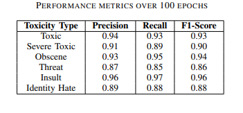
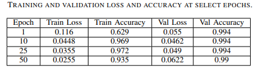

# Toxic Comment Classification Using Bidirectional Sequence Classifiers

* Dataset Used: [Jigsaw Toxic Comment Classification Challenge](https://www.kaggle.com/c/jigsaw-toxic-comment-classification-challenge)
* Preprocessed the textual dataset using Keras.
* Improved the model accuracy to around 97%.
* Performance Metrics:
  

* Categorical Cross-Entropy Loss: 0.0620
* Categorical Cross-Entropy Validation Loss: 0.0478
  

